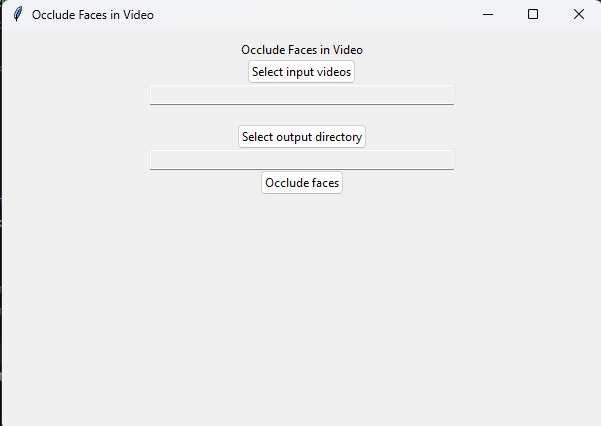

# Face Occlusion for Videos

This project provides a command-line program and a GUI for occluding facial features in videos. The goal was to create a simple tool that allows for partial occlusion based on facial regions (e.g. eyes, mouth, nose) and facilitates the processing of multiple videos.

## Installation

Clone this repository and install the python dependencies, preferably to a virtual environment.

```
    git clone https://github.com/DavidHTwastaken/face-occlusion-for-video.git
    cd face-occlusion-for-video
    pip install -r requirements.txt
```

## Usage/Examples

Command line guide:

```
options:
  -h, --help            show this help message and exit
  --input INPUT [INPUT ...], -i INPUT [INPUT ...]
                        Path to the input video file; if no input files are
                        provided, the webcam feed will be used
  --output OUTPUT, -o OUTPUT
                        Path to the output video file or directory
  --suffix SUFFIX, -s SUFFIX
                        Characters to append to the output video file name
  --show                Show the video while processing
  --keep-audio          Keep the audio in the output video
  --features FEATURES [FEATURES ...], -f FEATURES [FEATURES ...]
                        Features to occlude. Options: eyes (e), mouth (m),
                        nose (n), whole face (f). Defaults to whole face.
```

Occlude whole faces (default behavior) in video files `file1.mp4` and `file2.mp4`, and store the results in the directory called `output_dir`:

`python cli.py -i file1.mp4 file2.mp4 -o output_dir -f f`

Occlude eyes, nose, and mouth in `input.mkv` and store the result as `input_occluded.mkv` in the same directory (default behavior):

`python cli.py -i input.mkv --features eyes mouth nose`

## GUI

Currently, the GUI simply consists of an input field, an output field, and a button to run the occlusion process (whole face).

The interface was made with Tkinter and the goal is to add the same functionality as in the command line version.



## Demo


## Design/Tools

The input videos are opened with OpenCV, where each frame is then passed to Google’s MediaPipe Face Landmarker which produces a mesh representing facial regions.

MediaPipe provides mappings from mesh regions to facial features (e.g. left eye), so the program simply constructs a polygon based on the
coordinates in the mesh and adds it to the current frame.

The GUI was made with Tkinter and provides the ability to open the file explorer so users can
select multiple video files for processing.
